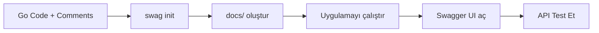

# 📚 Swagger/OpenAPI Documentation Guide

## 🎯 Ne İşe Yarıyor?

Swagger (OpenAPI), API'niz için **otomatik interaktif dokümantasyon** oluşturur. Özel formatlı Go comment'leri ile:

- 📖 API endpoint'lerini otomatik dokümante eder
- 🧪 Browser'dan direkt test edebilirsiniz
- 📋 Request/response örnekleri gösterir
- 🔐 Authentication test edilebilir
- 📄 Professional API dokumentasyonu

## 🚀 Nasıl Kullanılır?

### 1. Swag CLI Tool'u Yükle

```bash
go install github.com/swaggo/swag/cmd/swag@latest
```

### 2. Dependencies İndir

```bash
go mod download
```

### 3. Swagger Dokümantasyonu Oluştur

```bash
swag init -g cmd/ugin/main.go -o docs
```

Bu komut `docs/` klasöründe otomatik dokümantasyon oluşturur.

### 4. Uygulamayı Çalıştır

```bash
make run
# veya
go run cmd/ugin/main.go
```

### 5. Swagger UI'a Eriş

Browser'ınızda açın:
```
http://localhost:8081/swagger/index.html
```

## 📝 Comment Formatı

### Genel API Bilgileri (main.go veya swagger.go)

```go
// @title           UGin API
// @version         1.0
// @description     API açıklaması
// @host            localhost:8081
// @BasePath        /api/v1
// @securityDefinitions.apikey ApiKeyAuth
// @in header
// @name Authorization
```

### Endpoint Dokümantasyonu

```go
// GetByID handles GET /posts/:id
// @Summary Get post by ID
// @Description Get a single post by ID
// @Tags posts
// @Accept json
// @Produce json
// @Param id path string true "Post ID"
// @Success 200 {object} domain.Post
// @Failure 404 {object} map[string]string
// @Failure 500 {object} map[string]string
// @Router /api/v1/posts/{id} [get]
func (h *PostHandler) GetByID(c *gin.Context) {
    // implementation
}
```

### Comment Açıklamaları

| Annotation | Açıklama | Örnek |
|------------|----------|-------|
| `@Summary` | Kısa başlık | `@Summary Get post by ID` |
| `@Description` | Detaylı açıklama | `@Description Get a single post...` |
| `@Tags` | Endpoint grubu | `@Tags posts` |
| `@Accept` | Accept edilen format | `@Accept json` |
| `@Produce` | Dönen format | `@Produce json` |
| `@Param` | Parametre tanımı | `@Param id path string true "Post ID"` |
| `@Success` | Başarılı response | `@Success 200 {object} domain.Post` |
| `@Failure` | Hata response | `@Failure 404 {object} map[string]string` |
| `@Router` | Route path | `@Router /api/v1/posts/{id} [get]` |
| `@Security` | Authentication | `@Security ApiKeyAuth` |

### Parametre Tipleri

```go
// Path parameter
// @Param id path string true "User ID"

// Query parameter
// @Param search query string false "Search keyword"

// Body parameter
// @Param user body domain.User true "User object"

// Header parameter
// @Param Authorization header string true "Bearer token"
```

### Response Tipleri

```go
// Object response
// @Success 200 {object} domain.Post

// Array response
// @Success 200 {array} domain.Post

// Primitive response
// @Success 200 {string} string "success"

// Map response
// @Success 200 {object} map[string]interface{}
```

## 🎨 Swagger UI Kullanımı

### 1. Endpoint'i Seç

![Swagger UI'da endpoint listesi]

### 2. "Try it out" Butonuna Tıkla

### 3. Parametreleri Gir

- Path parametreleri
- Query parametreleri
- Request body (JSON)

### 4. "Execute" Butonuna Bas

### 5. Response'u Gör

- Status code
- Response body
- Response headers
- Request details

## 🔐 Authentication Test

### JWT Token ile Test

1. **Sign In endpoint'ini çağır:**
   - `POST /api/v1/auth/signin`
   - Email ve password gir
   - Response'dan `access_token`'ı kopyala

2. **Authorize butonuna tıkla** (sağ üst köşe)

3. **Token'ı gir:**
   ```
   Bearer YOUR_ACCESS_TOKEN_HERE
   ```

4. **Artık protected endpoint'leri test edebilirsin!**
   - `GET /api/v1/postsjwt`
   - Token otomatik olarak eklenir

## 📁 Dosya Yapısı

```
ugin/
├── docs/                          # Otomatik oluşturulan
│   ├── docs.go                   # Swagger spec
│   ├── swagger.json              # JSON format
│   └── swagger.yaml              # YAML format
├── cmd/ugin/
│   ├── main.go                   # Ana uygulama
│   └── swagger.go                # Swagger genel bilgileri
└── internal/handler/http/
    ├── post.go                   # Endpoint comment'leri
    └── auth.go                   # Endpoint comment'leri
```

## 🔄 Workflow



## 💡 Best Practices

### 1. Her Endpoint için Comment Ekle

✅ **İyi:**
```go
// @Summary Create post
// @Description Create a new post
// @Tags posts
// @Accept json
// @Produce json
// @Param post body domain.Post true "Post object"
// @Success 201 {object} domain.Post
// @Router /api/v1/posts [post]
func (h *PostHandler) Create(c *gin.Context) { }
```

❌ **Kötü:**
```go
func (h *PostHandler) Create(c *gin.Context) { }
```

### 2. Tüm Response Kodlarını Belirt

```go
// @Success 200 {object} domain.Post
// @Failure 400 {object} map[string]string "Bad Request"
// @Failure 401 {object} map[string]string "Unauthorized"
// @Failure 404 {object} map[string]string "Not Found"
// @Failure 500 {object} map[string]string "Internal Server Error"
```

### 3. Request Body Örnekleri

```go
// @Param post body domain.Post true "Post object"
```

Domain struct'ınıza JSON tag'leri eklemeyi unutmayın:
```go
type Post struct {
    ID          uint   `json:"id"`
    Name        string `json:"name"`
    Description string `json:"description"`
}
```

### 4. Düzenli Güncelle

Her endpoint değişikliğinden sonra:
```bash
swag init -g cmd/ugin/main.go -o docs
```

## 🛠️ Makefile Entegrasyonu

`Makefile`'a şunu ekleyin:

```makefile
# Generate swagger documentation
swagger:
	@echo "Generating Swagger documentation..."
	@swag init -g cmd/ugin/main.go -o docs
	@echo "Swagger documentation generated!"

# Run with swagger generation
run-swagger: swagger run
```

Kullanım:
```bash
make swagger  # Sadece docs oluştur
make run-swagger  # Docs oluştur ve çalıştır
```

## 📊 Örnek Swagger UI Screenshots

### Ana Sayfa
- API başlığı ve versiyonu
- Tüm endpoint'lerin listesi
- Tag'lere göre gruplandırılmış

### Endpoint Detayı
- Parameters (path, query, body)
- Request/Response örnekleri
- Try it out özelliği
- Model şemaları

### Authentication
- Authorize butonu
- Token girişi
- Authenticated endpoint'ler

## 🚀 Production Deployment

### Swagger'ı Production'da Devre Dışı Bırakma

```go
// main.go içinde
if os.Getenv("ENVIRONMENT") != "production" {
    router.GET("/swagger/*any", ginSwagger.WrapHandler(swaggerFiles.Handler))
}
```

Veya environment variable ile:
```go
router.GET("/swagger/*any", ginSwagger.DisablingWrapHandler(
    swaggerFiles.Handler,
    "DISABLE_SWAGGER_HTTP_HANDLER",
))
```

### Güvenlik

Production'da Swagger'ı:
- Tamamen kapat, VEYA
- Basic auth ile koru, VEYA
- Sadece internal network'ten erişilebilir yap

## 📚 Kaynaklar

- [Swaggo GitHub](https://github.com/swaggo/swag)
- [Gin-Swagger](https://github.com/swaggo/gin-swagger)
- [Swagger Annotation](https://github.com/swaggo/swag#general-api-info)
- [OpenAPI Specification](https://swagger.io/specification/)

## 🎯 Sonuç

Swagger kullanarak:
- ✅ Otomatik API dokümantasyonu
- ✅ İnteraktif test ortamı
- ✅ Professional görünüm
- ✅ Takım içi paylaşım kolaylığı
- ✅ Frontend dev'lere net API contract

**Artık API'nizi kod comment'leri ile dokümante edebilirsiniz!** 🎉

